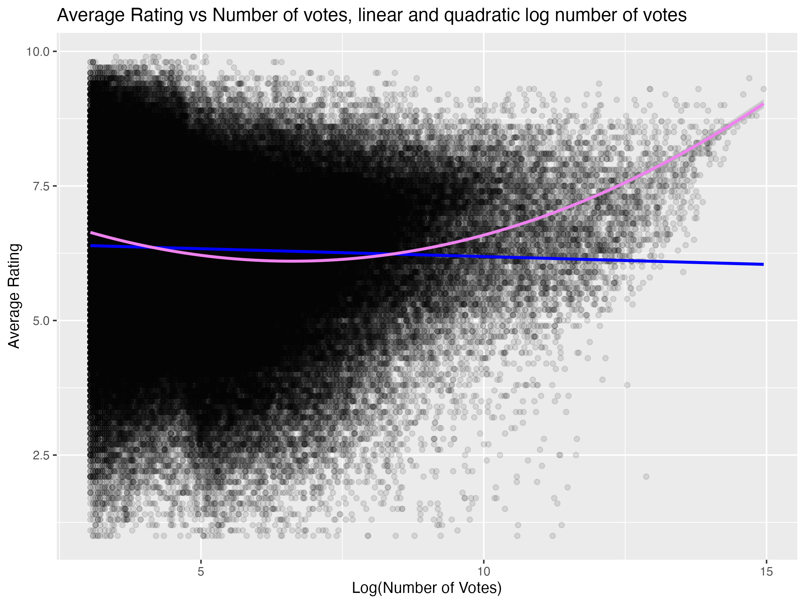
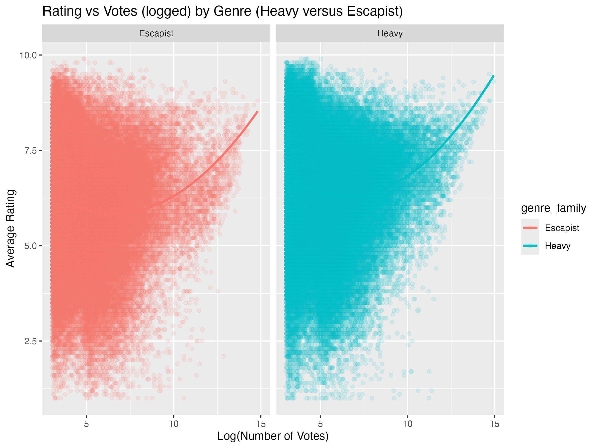
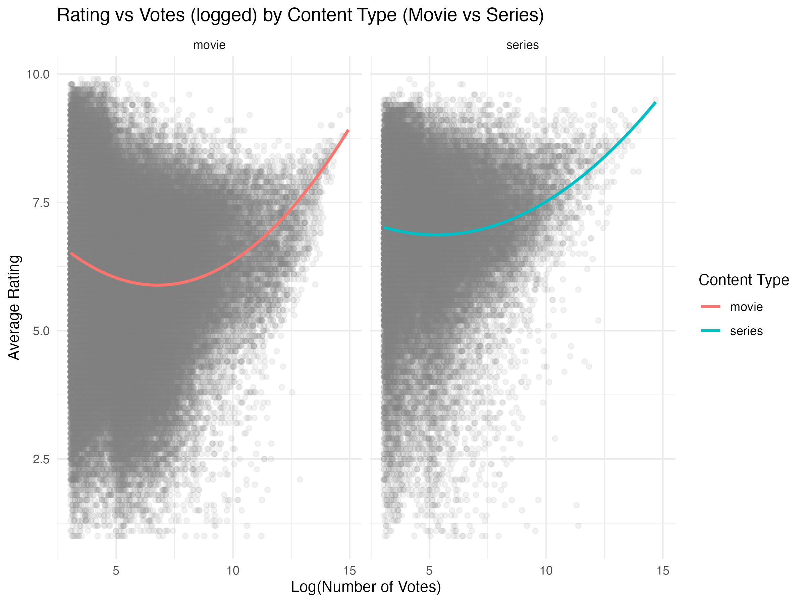

```{r setup, include=FALSE}
knitr::opts_chunk$set(warning = FALSE, message = FALSE)
### Setup ###
# Loading Libraries
library(dplyr)
library(tidyverse)
library(readr)
library(here)
library(tidyr)
library(broom)
library(vroom)
library(ggplot2)
library(ordinal)
```

# 1.Introduction 

The Internet Movie Database (IMDb) is one of the most widely used online platforms for film and television information, containing millions of titles along with user-generated ratings and vote counts. It serves as a valuable resource for studying audience preferences and perceptions of quality across a diverse range of genres and formats.

This study investigates the relationship between popularity (measured by the number of votes) and perceived quality (average IMDb rating) of films and series. Using IMDb data, the analysis examines whether highly rated titles also attract more votes, or whether popularity and quality diverge. Furthermore, it explores whether this relationship differs across genres and between movies and series (i.e., content form).

# 2.Theoretical Framework and Research Motivation 
The relationship between the number of votes and the average rating of movies provides valuable insights into audience behaviour and preferences. Understanding this relationship can inform film studios, reviewers, and marketing professionals about how viewers engage with content and express their opinions online.

Based on prior research on the polarization effect - the tendency for individuals with strong positive or negative opinions to be more likely to share them - this study expects the relationship between the number of votes and average rating to be non-linear (quadratic) rather than linear. Two competing hypotheses are proposed regarding the shape of this relationship. First, both highly rated and poorly rated titles may attract more attention and engagement, as individuals with strong opinions are more likely to share them. This would produce a concave upward (U-shaped) relationship between rating and vote count. Conversely, widely viewed mainstream films might receive a high number of ratings that are relatively moderate, reflecting a broader audience appeal. This would result in a concave downward (inverted U-shaped) relationship.

Moreover, the relationship between ratings and number of votes Genres may attract distinct audience segments that vary in their rating behavior—mainstream genres might yield different rating distributions compared to niche ones. Likewise, differences between movies and series, such as viewing length and audience engagement patterns, could also influence the relationship between popularity and perceived quality. As such the analysis also controls for (1) differences in genre and (2) differences between movies and series.

# 3.Research Question 
The current project sets out to answer the following research question: *What is the relationship between the number of votes and the average rating of movies on IMDb?*

Additionally, this relationship may depend on several sub-factors, resulting in two sub-questions:
1.Does the relationship between number of votes and average rating differ across movie genres (escapist (fantasy, comedy, romance) and heavy (drama, thriller))?
2.Does the relationship between number of votes and average rating differ across movies and series (i.e. content form)?

# 4.Data
## 4.1.Data Sourcing 
We programmatically downloaded two public IMDb datasets: 
• title.basics (title type, year, genres) 
• title.ratings (average rating, number of votes)

Given the substantial size of the files and the need for a manageable data set for our analysis, we have selected a reduced sample of 200,000 observations from the IMDb data set. This sample size enables us to conduct thorough statistical analyses while ensuring efficiency. A seed was set at 123 to ensure that analysis is run with the same data.

## 4.2.Data preparation 
To ensure that the IMDb datasets were consistent and suitable for statistical analysis, the two source files (title.basics and title.ratings) were merged using the unique identifier tconst using inner-join. An inner join was chosen because it retains only titles that appear in both datasets (i.e., titles that have both descriptive information and user ratings).This approach ensures that every observation in the final dataset contains complete and relevant information for the analysis.

Data cleaning steps included:
•	Casting startYear to integer – Ensured that the year variable could be used for temporal filtering, grouping, and period classification.
•	Filtering only movies and series – Excluded other types of titles (e.g., short films, video games, or documentaries) to maintain a consistent comparison across similar content forms.
•	De-duplicating titles – Removed potential duplicates in the IMDb data to avoid over-representation of the same title.
•	Dropping titles with fewer than 20 votes – After data inspection, we found that many titles had just a few votes (ie data is right skewed). Titles with very few votes were considered unreliable indicators of audience opinion; removing them reduced statistical noise whilst retaining enough variation to answer the primary research question. 
•	Mapping genres into three broader families (Escapist, Heavy, Mixed) – Simplified the complex and overlapping IMDb genre system into analytically meaningful categories, improving interpretability across genres. The Mixed genre was filtered out; this would overcomplicate analysis (three levels of an independent variable with multiple levels of moderators) and deletion also resulted in a more clean measure of the moderating effect of genres.

Additional features were engineered to support the analysis:
•	votes2 – The squared number of votes, used to capture potential non-linear relationships between popularity and quality.
•	log_votes and log_votes2 – Logarithmic transformations of vote count and its square to reduce skewness and handle large disparities between extremely popular and niche titles.
•	period – Classified titles into four historical periods (Pre-War, Interwar, Post-War, Modern), allowing temporal trends in popularity and rating behavior to be explored. 
•	rating_category – Grouped IMDb ratings into ordinal categories (Very Bad to Excellent), providing a more intuitive interpretation of perceived quality.

These steps produced three progressively refined datasets used throughout the analysis:
•	imdb_clean – The base cleaned dataset after initial filtering and deduplication.
•	imdb_enriched – The dataset with added genre family and period variables.
•	imdb_analysis – The final, analysis-ready dataset including transformations and derived metrics for modeling and 

## 4.3.Variables 
Stuk Sanne van de Readme (ie tabellen)

# 5.Research Method
## 5.1.Main Analysis
To empirically test the research question, a series of linear regression models were estimated using IMDb data.
In these models, the dependent variable (DV) is the average IMDb rating, representing viewers’ perceived quality of a title. The independent variable (IV) is the number of votes, log-transformed to correct for skewness in the distribution of popularity across titles. Given theoretical expectations from the polarization effect, a squared term of the log number of votes (log_votes²) was added to capture potential non-linear (quadratic) patterns between popularity and perceived quality. The period of release was included as a control variable to account for differences in rating behavior over time. To address the sub-questions, moderator analyses were performed by adding interaction terms between the vote variables and (1) genre family and (2) content type (movie vs. series).These moderators allow us to test whether the relationship between popularity and quality depends on genre characteristics or format differences. 

As such, we performed a moderated regression analysis, broken up into several pieces to answer our research (sub)question(s). Linear regression was chosen as the primary analytical technique because it allows for straightforward interpretation of main and interaction effects and flexible testing of both linear and non-linear relationships. 

## 5.2.Regressions
Four linear regression models were estimated sequentially to address the research question and sub-questions.

**Model 1: Baseline linear model**
"averageRating"=β_0+β_1 (log⁡_votes)+β_2 ("period")+ϵ

This model assesses the linear relationship between the log-transformed number of votes and the average rating, controlling for time period.

**Model 2: Quadratic model**
"averageRating"=β_0+β_1 (log⁡_votes)+β_2 (log⁡_votes^2)+β_3 ("period")+ϵ

This model tests for a non-linear (quadratic) relationship between rating and number of votes; allowing to answer the main research question. An ANOVA comparison between Model 1 and Model 2 determines whether the quadratic term significantly improves model fit.

**Model 3: Genre as a moderator**
"averageRating"=β_0+β_1 (log⁡_votes)+β_2 (log⁡_votes^2)+β_3 ("genre_family")+β_4 (log⁡_votes×"genre_family")+β_5 (log⁡_votes^2×"genre_family")+ϵ

This model investigates whether the votes–ratings relationship differs between Escapist and Heavy genres.

**Model 4: Content form as a moderator**
"averageRating"=β_0+β_1 (log⁡_votes)+β_2 (log⁡_votes^2)+β_3 ("type")+β_4 (log⁡_votes×"type")+β_5 (log⁡_votes^2×"type")+ϵ

This model tests whether the relationship varies between movies and series, given their differences in audience engagement and viewing context.

Note that additionally, we planned to run a fifth model with rating as a category variable. However, when running this model we realized that meaningful categories were hard to define based on ratings (is a rating of 1.9 significantly worse than 2.0 if categories are defined as 1-2, 3-4, 5-6 etc). As such, this analysis was not included in the main reporting.

The table below summarizes the regressions. 

| Model | DV | IVs | Purpose |
|-------|----|-----|---------|
| 1. Linear | averageRating | log_votes + period | Baseline effect |
| 2. Quadratic | averageRating | log_votes + log_votes2 + period | Nonlinearity |
| 3. Interaction Genre | averageRating | + genre_family interactions | Compare Escapist vs Heavy |
| 4. Interaction Type | averageRating | + type interactions | Compare movies vs series |


The key visuals that come out of these models are:

- Scatter + linear vs quadratic fits.

- Separate plots by genre family and type.

# 6.Analysis

**Model 1 – Linear relationship between ratings and votes.**
The coefficient for log_votes is negative and highly significant (β = –0.032, p < .001); thus titles with more votes tend to have slightly lower average ratings. This would suggest that movies with more votes have a lower rating overall. However, model fit is very low (R² = 0.004), indicating the linear model explains little variation. Moreover, the period controls are significant: Modern films score higher on average than other periods (+0.17) and Pre-War films have substantially lower ratings (–0.28).


**Model 2 – Testing for nonlinearity (polarization effect).**
This model shows that – as expected – that the relationship between ratings and votes is clearly non-linear: log_votes is negative (β = –0.56, p < .001) and log_votes² is positive (β = +0.042, p < .001). This combination indicates a U-shaped relationship between number of votes and ratings. At low-to-moderate numbers of votes, more votes are associated with lower ratings. At many votes, ratings start increasing again. Moreover, the model fit improves notably (R² = 0.026 vs 0.004 in Model 1) and the ANOVA test confirms that adding the quadratic term significantly improves fit (F(1, 256976) = 5707.8, p < .001).




htmltools::tags$iframe(src = "../../gen/output/regression_models.html", width = "100%", height = "600px")

**Model 3 – Moderation by Genre Family.**
The main effect of the heavy genre is positive (β = +0.59, p < .001): heavy, serious genres (drama, war, biography) tend to have higher ratings overall than escapist genres (comedy, action). The interaction terms are small yet significant:
•	log_votes × genre_familyHeavy: negative (β = –0.056, p < .001)
•	log_votes² × genre_familyHeavy: positive (β = +0.0049, p < .001)
As such, the U-shaped curve is steeper for heavy genres; i.e. polarization is more pronounced for heavy titles.




**Model 4** – Moderation by content type (movies vs. series). First, series are rated lower on average than movies (β = –0.26, p < .001).The interaction pattern is opposite to the genre effect:
•	log_votes × series: positive (β = +0.299, p < .001)
•	log_votes² × series: negative (β = –0.0157, p < .001)
The main curve (for movies) is U-shaped, but for series, these interactions flatten or even invert the curve.




# 7.Conclusion and Recommendations
The current study studied the the relationship between the number of votes and the average rating of movies on IMDb. Additionally, it explored whether this relationship between number of votes and average rating differed across movie genres (escapist (fantasy, comedy, romance) and heavy (drama, thriller)) and across movies and series (i.e. content form). Based on the results of the study, we conclude that from a simple linear analysis it appears that movies with more votes have a lower rating overall. However, adding a quadratic term for number of votes, we conclude that titles with very few or very many votes have higher ratings on average than those with a moderately number of votes.  — either high praise or sharp criticism — while moderately popular titles receive more average evaluations. 

Moreover, we conclude that audiences of heavy genres appear more divided: some viewers rate these titles very highly, while others rate them quite low. Escapist genres show a flatter relationship, suggesting more uniform audience reception. Moreover, the type of content (movies vs. series) affects the relationship between number of votes and rating. For movies, the polarization effect is evident: both very popular and very niche films get stronger reactions.For series, however, the pattern trends toward an inverted U-shape — moderately popular series tend to receive higher average ratings than very niche or extremely popular ones. 

Based on these findings, we offer several recommendations. First, for platforms like IMDb, understanding the non-linear relationship between the number of votes and average ratings can help in interpreting consumer feedback more accurately. Moderately popular titles may appear average not due to poor quality, but due to the tendency of extreme ratings at the low and high ends to balance out.

Moreocer, content creators should consider the genre-specific differences in audience reception. We note that genres are rated differently: heavy genres (drama, thriller) tend to get more polarized responses whereas escapist genres (fantasy, comedy, romance) generally receive more uniform evaluations, indicating broader appeal. Marketing strategies for heavy genres might thus target more specifically a niche group of consumers who really like such content, boosting overall ratings.

Third, the type of content influences audience reaction patterns. For movies, extreme popularity or niche status often leads to stronger audience reactions, while series tend to follow an inverted U-shape, with moderately popular series receiving the highest ratings. This is highly insightful for platforms such as Netflix or HBO for example, which might prompt them to realize more satisfaction for average mainstream series content, but more specific and niche video content. 

# 8.Limitations and Future Research 
We note that our analysis is not very granular and we do not control for differences between consumers. This is partly due to unavailability of data on consumer characteristics and also partly to limit the difficulty of the analysis and interpretation. However, this is a great limitation to the extent that differences between consumers may affect the study results, resulting in erroneous conclusions. Future research should take into account more controls, ensuring a limited influence of confounding factors. 

Another limitation is the filtering of votes. As discussed we filtered out titles with less than 20 votes, concluding that the ratings of less than 20 consumers would not be representative for a general rating of a title. However, the 20 votes cutoff is rather arbitrary; we could have taken 40 or 50 as well or any other (low) number. By effect, we do filter out some polarization as titles with fewer number of votes may be rated more extreme. We realize this limitation but we also contend that fewer votes (5 for example) may be arbitrary and do not represent consumer opinions. Future research could explore whether other cutoffs in number of votes would influence ratings. 

Additionally, our study does not account for temporal effects. Ratings may evolve over time as more consumers provide input. Ignoring these dynamics may mask important patterns in the data and lead to conclusions that do not generalize across time.

# Reproducibility & Workflow
- The entire pipeline is automated via relative paths and can be run with a single make command from the repository root.

- All raw data is downloaded programmatically; generated files are written to data/clean.

- .gitignore excludes generated files to keep version control clean.

- The repository follows the recommended directory structure (src/1-raw-data, data/clean, analysis).

- Multiple team members contributed via commits, pull requests, and GitHub Issues/Project Board, ensuring transparency.

# Appendix
- Session info

- Extra regression tables